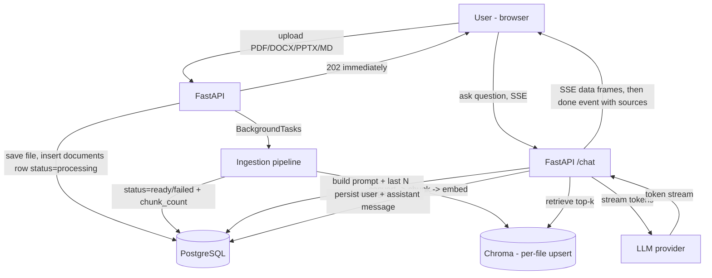

# KnowledgeHub AI

**Live:** [knowledgehubai.nandes.tech](https://knowledgehubai.nandes.tech) · **Status:** v1.0.0 MVP

Internal knowledge assistant that solves knowledge loss from employee turnover. Employees upload company documents (PDF, Word, PowerPoint, Markdown), and anyone can chat with the knowledge base — with streaming answers, conversation history, and source citations. Full-stack, production-ready RAG product: auth, rate limiting, structured logging with cost tracking, and a live HTTPS deployment.

## Demo

> Screenshots/GIF pending — see [`docs/screenshots/`](docs/screenshots/) for what's expected and drop them in there once captured; swap this note for `` tags pointing at those files.

The loop the product is built around: upload a PDF → it's chunked and embedded in the background → ask a question → get a streamed, cited answer pulled from that document.

## Features

- **Chat with your documents** — RAG over uploaded content, answers stream token-by-token over SSE
- **Source citations** — every grounded answer shows which document(s) it came from
- **Conversation history** — persisted, resumable, listed in a sidebar
- **Knowledge upload** — PDF / DOCX / PPTX / MD → background ingestion → searchable, with live status and duplicate detection
- **Auth** — email + password (JWT), all data scoped per user
- **Production hygiene** — per-user rate limiting, input length limits, strict CORS, security headers, structured JSON logs, an admin stats endpoint (messages/day, doc count, estimated LLM cost)
- **Dockerized**, deployed at a live URL

## Architecture



Full data model, request-flow detail, and the backup approach live in [`docs/architecture.md`](docs/architecture.md).

## Design decisions

Four trade-offs that shaped the build:

| Decision | Why |
|---|---|
| **SSE over WebSockets** | The token stream only ever flows server → client — there's no need for a client → server channel mid-answer. SSE gets that with a plain HTTP response and automatic browser reconnection, instead of a full duplex protocol, a separate handshake, and manual reconnect logic. |
| **Per-file upsert over full collection rebuild** | Naively re-embedding and re-indexing the entire knowledge base on every upload is O(n) work for an O(1) change, and it doesn't scale past a handful of documents. Each chunk gets a deterministic ID (`{document_id}::{chunk_index}::{content_hash[:12]}`), so re-ingesting or deleting one file only ever touches that file's vectors. |
| **Monorepo** | Backend and frontend evolve together during MVP build-out, and the only coupling between them is the HTTP API contract (`docs/api-contract.md`). Keeping them in one repo means an API change and its consuming frontend change land in a single commit instead of a cross-repo version dance. |
| **`BackgroundTasks` over Celery** | Ingestion is I/O-bound, infrequent relative to chat traffic, and a single backend replica is already a hard constraint (Chroma's on-disk index can't be shared across writers — see below). A queue + worker + broker is real operational surface area for a problem `BackgroundTasks` already solves at this scale; revisit only if ingestion volume demands horizontal scaling. |

One consequence worth naming: because Chroma runs in-process against a local persist directory, **the backend can only ever run as a single replica** — two processes writing the same vector store would corrupt it. That's part of why `BackgroundTasks` (in-process, no separate worker fleet) was the right call for v1, not just the simplest one.

## Stack

FastAPI + PostgreSQL + Chroma on the backend, Next.js + TypeScript + Tailwind on the frontend, SSE for streaming, JWT auth, Docker Compose for local dev, deployed on a single IPv6-only VPS behind Cloudflare with rootless Podman. Full rationale in [`docs/architecture.md`](docs/architecture.md).

## Run locally

```bash
git clone https://github.com/nandes007/knowledgehub-ai.git && cd knowledgehub-ai
cp .env.example .env   # fill in OPENAI_API_KEY at minimum
docker compose up
```

Frontend at `http://localhost:3000`, backend at `http://localhost:8000` (`/healthz` for a liveness check).

## Docs

- [`docs/architecture.md`](docs/architecture.md) — data flow, diagrams, design decisions, backup approach
- [`docs/api-contract.md`](docs/api-contract.md) — endpoints, request/response shapes, SSE event format
- [`docs/deployment-plan.md`](docs/deployment-plan.md) — the live-deployment setup (IPv6-only host, Cloudflare, Podman, Supabase)
- [`docs/evals.md`](docs/evals.md) — retrieval + RAGAS evaluation: method, baseline numbers, and what the hybrid-search experiment measured
- [`knowledgehub-ai.md`](knowledgehub-ai.md) — full project plan
- [`tasks/todo.md`](tasks/todo.md) — task-by-task build tracker, linked to GitHub issues

## What's next

MVP scope (auth, streaming chat, upload/ingest, citations, deploy, observability, hardening) is done, along with department-scoped visibility, hybrid search, an admin dashboard, and the evaluation suite in [`docs/evals.md`](docs/evals.md). Planned next: exact-identifier eval questions to settle the `HYBRID_SEARCH` default, and a larger corpus so `recall@5` regains signal — see [`knowledgehub-ai.md`](knowledgehub-ai.md) for the full v2 plan.
