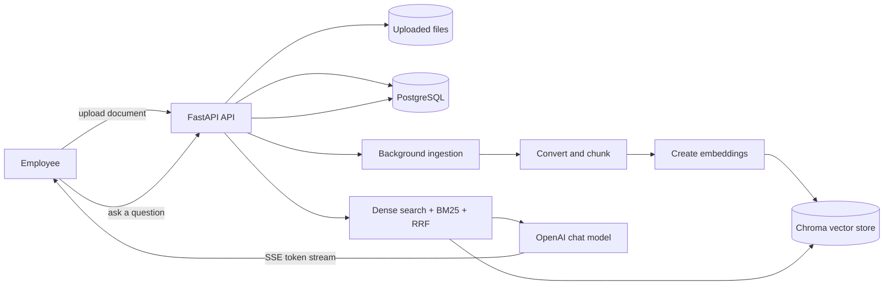

# KnowledgeHub AI

[Live application](https://knowledgehubai.nandes.tech) · [Report an issue](https://github.com/nandes007/knowledgehub-ai/issues/new) · [View open issues](https://github.com/nandes007/knowledgehub-ai/issues)

KnowledgeHub AI is a self-hostable knowledge assistant for teams, developed in public and intended for open-source collaboration. It turns internal documents into a searchable knowledge base so employees can ask questions and receive concise, source-cited answers.

The project addresses a common problem: important knowledge is often scattered across files or leaves with the people who created it. KnowledgeHub AI keeps that information accessible, searchable, and tied to its original source.

## Contents

- [What it does](#what-it-does)
- [How it works](#how-it-works)
- [Access model](#access-model)
- [Tech stack](#tech-stack)
- [Run locally with Docker](#run-locally-with-docker)
- [Run without Docker](#run-without-docker)
- [Configuration](#configuration)
- [Tests and quality checks](#tests-and-quality-checks)
- [Contributing](#contributing)
- [Deployment](#deployment)
- [Current limitations](#current-limitations)
- [License](#license)

## What it does

- Uploads PDF, DOCX, PPTX, and Markdown files.
- Converts, chunks, embeds, and indexes documents in the background.
- Combines semantic search with BM25 keyword search and reciprocal rank fusion.
- Streams answers to the browser with Server-Sent Events (SSE).
- Shows the source documents used for each answer.
- Saves conversations so users can return to previous work.
- Separates data by company and supports company-wide or department-only documents.
- Provides member, company admin, and platform superadmin roles.
- Gives admins usage, document, and estimated LLM cost statistics.
- Includes rate limiting, strict CORS, security headers, structured logs, and database migrations.

## How it works

The main product loop is simple:

1. An administrator uploads a company document.
2. The API saves the file and immediately marks it as `processing`.
3. A background task converts the file to Markdown, splits it into chunks, creates embeddings, and writes the chunks to Chroma.
4. The document becomes `ready` and can be searched.
5. An employee asks a question.
6. The retrieval pipeline finds relevant chunks allowed by the employee's company and department.
7. The LLM receives those chunks, recent conversation history, and grounding instructions.
8. The answer streams to the browser and is saved with its sources.


```mermaid
flowchart LR
    User[Employee] -->|upload document| API[FastAPI API]
    API --> Files[(Uploaded files)]
    API --> DB[(PostgreSQL)]
    API --> Ingest[Background ingestion]
    Ingest --> Convert[Convert and chunk]
    Convert --> Embed[Create embeddings]
    Embed --> Chroma[(Chroma vector store)]

    User -->|ask a question| API
    API --> Retrieve[Dense search + BM25 + RRF]
    Retrieve --> Chroma
    API --> DB
    Retrieve --> LLM[OpenAI chat model]
    LLM -->|SSE token stream| User
```

PostgreSQL stores accounts, companies, departments, document metadata, conversations, and messages. Uploaded files are the source material, while Chroma is a derived search index that can be rebuilt by ingesting those files again.

## Access model

KnowledgeHub AI is multi-tenant. Data and retrieval are scoped to a company.

| Role | Responsibilities |
| --- | --- |
| Member | Chat with permitted knowledge and view their conversations. |
| Company admin | Manage documents, departments, team members, and company usage. |
| Platform superadmin | Approve registrations and manage companies and company admins. |

Company documents are visible to everyone in that company. Department documents are available only to members of the matching department; company admins can manage all documents in their company.

## Tech stack

| Area | Technology |
| --- | --- |
| Frontend | Next.js 16, React 19, TypeScript, Tailwind CSS 4 |
| Backend API | Python 3.12, FastAPI, Uvicorn |
| Relational data | PostgreSQL 16, SQLModel, SQLAlchemy, Alembic |
| Retrieval | Chroma, OpenAI embeddings, BM25, reciprocal rank fusion |
| Document processing | MarkItDown, LangChain text splitters |
| Answer generation | OpenAI API with a provider abstraction |
| Authentication | JWT, Passlib, bcrypt |
| Streaming | Server-Sent Events |
| Testing | pytest, HTTPX, Vitest |
| Local runtime | Docker Compose |
| Production | Podman, nginx, Cloudflare, Ansible, Tailscale |

## Repository structure

```text
knowledgehub-ai/
├── backend/
│   ├── app/                 # FastAPI routes, models, services, and auth
│   ├── ingestion/           # conversion, chunking, and vector indexing
│   ├── alembic/             # database migrations
│   ├── evals/               # retrieval and RAGAS evaluation tools
│   └── tests/               # backend test suite
├── frontend/
│   ├── app/                 # Next.js routes and layouts
│   ├── components/          # product UI components
│   └── lib/                 # API, auth, and SSE clients
├── deploy/ansible/          # production provisioning and deployment
├── docs/                    # architecture, API, evaluation, and deployment docs
├── docker-compose.yml       # local development stack
└── .env.example             # documented environment variables
```

## Run locally with Docker

### Prerequisites

- Git
- Docker with the Compose plugin
- An OpenAI API key

Clone the repository and create your local environment file:

```bash
git clone https://github.com/nandes007/knowledgehub-ai.git
cd knowledgehub-ai
cp .env.example .env
```

Set at least these values in `.env`:

```dotenv
OPENAI_API_KEY=your-openai-api-key
JWT_SECRET=replace-this-with-a-long-random-value
```

You can generate a development JWT secret with:

```bash
openssl rand -hex 32
```

Build and start the application, then apply the database migrations:

```bash
docker compose up --build -d
docker compose exec backend alembic upgrade head
```

Use `docker compose logs -f` to follow the application logs.

The services will be available at:

| Service | URL |
| --- | --- |
| Web application | <http://localhost:3000> |
| API | <http://localhost:8000> |
| Interactive API docs | <http://localhost:8000/docs> |
| Health check | <http://localhost:8000/healthz> |
| PostgreSQL | `localhost:5432` |

### Create the first superadmin

Registration creates a company administrator in a pending state. Bootstrap one platform superadmin so registrations can be approved:

```bash
docker compose exec backend python -m app.cli create-superadmin \
  --email admin@example.com \
  --password 'replace-with-a-secure-password'
```

Then:

1. Register a company account at <http://localhost:3000/register>.
2. Sign in as the superadmin and open <http://localhost:3000/admin>.
3. Approve the pending company administrator.
4. Sign in with the approved company account.

Stop the stack with `docker compose down`. Add `--volumes` only when you intentionally want to delete the local PostgreSQL, Chroma, and upload data.

## Run without Docker

For development directly on the host, install Python 3.12+, [uv](https://docs.astral.sh/uv/), Node.js 22+, and PostgreSQL 16. Create `.env` as described above and make sure its `DATABASE_URL` points to your local database.

Start the backend:

```bash
cd backend
uv sync --extra dev
uv run alembic upgrade head
uv run uvicorn app.main:app --reload --host 127.0.0.1 --port 8000
```

In another terminal, start the frontend:

```bash
cd frontend
npm ci
npm run dev
```

The backend reads the repository root `.env` even when it is started from `backend/`.

## Configuration

Copy `.env.example` rather than committing a real `.env`. The main settings are:

| Variable | Purpose | Local default |
| --- | --- | --- |
| `DATABASE_URL` | SQLAlchemy/psycopg PostgreSQL connection URL | Local PostgreSQL |
| `OPENAI_API_KEY` | Creates embeddings and generated answers | Required |
| `CHAT_MODEL` | OpenAI chat model | `gpt-4o-mini` |
| `EMBEDDING_MODEL` | OpenAI embedding model | `text-embedding-3-small` in `.env.example` |
| `HYBRID_SEARCH` | Enables dense + BM25 retrieval with RRF | `true` |
| `JWT_SECRET` | Signs authentication tokens | Must be changed |
| `JWT_EXPIRE_MINUTES` | Authentication token lifetime | `1440` |
| `CORS_ORIGINS` | Comma-separated permitted frontend origins | `http://localhost:3000` |
| `NEXT_PUBLIC_API_URL` | API URL used by the browser | `http://localhost:8000` |
| `CHROMA_PERSIST_DIR` | Local Chroma index directory | `./.chroma` |
| `UPLOAD_DIR` | Uploaded source file directory | `./uploads` |
| `MAX_UPLOAD_SIZE_MB` | Maximum document size | `25` |

Do not change `EMBEDDING_MODEL` after documents have been indexed unless you also rebuild the Chroma index. Vectors created by different embedding models are not compatible.

## Tests and quality checks

Backend:

```bash
cd backend
uv sync --extra dev
uv run pytest
```

Frontend:

```bash
cd frontend
npm ci
npm test
npm run lint
npm run build
```

Retrieval evaluation is separate from the normal test suite and may call the OpenAI API:

```bash
cd backend
uv sync --extra evals
uv run python -m evals.run_retrieval_metrics
uv run python -m evals.run_ragas
```

See [`docs/evals.md`](docs/evals.md) for the dataset, baseline results, experiments, and limitations.

## API and architecture notes

- The backend API contract is documented in [`docs/api-contract.md`](docs/api-contract.md).
- Chroma runs in-process against a local persistent directory. Production must use one backend replica because multiple writers cannot safely share that directory.
- Document ingestion currently uses FastAPI `BackgroundTasks`. It is suitable for the current single-replica deployment, but it is not a durable distributed job queue.
- The current LLM provider implementation uses OpenAI. The service boundary in `backend/app/services/llm.py` is intended to make additional providers possible.
- Generated answers are instructed to use retrieved company context and to say when the knowledge base does not contain an answer.
- Database schema changes must be made through Alembic migrations.

More detail is available in [`docs/architecture.md`](docs/architecture.md).

## Contributing

Contributions are welcome from developers, designers, technical writers, and people interested in knowledge management or retrieval-augmented generation.

### Before starting

1. Search the [open issues](https://github.com/nandes007/knowledgehub-ai/issues) to avoid duplicate work.
2. For a bug fix, describe the current behavior, expected behavior, and a reliable way to reproduce it.
3. For a large feature or architecture change, open an issue first so its scope and approach can be discussed before implementation.
4. Never include API keys, database passwords, `.env` files, uploaded company documents, or other private data in an issue or commit.

Good first contributions include documentation fixes, accessibility improvements, focused test coverage, support for additional document formats, retrieval evaluation cases, and clearly scoped issues labeled for contributors.

### Development workflow

1. Fork the repository and clone your fork.
2. Create a focused branch from `main`:

   ```bash
   git checkout -b fix/short-description
   ```

3. Follow the local setup instructions and make one focused change.
4. Add or update tests when behavior changes.
5. Run the relevant backend and frontend checks listed above.
6. Update documentation and `docs/api-contract.md` when an API changes.
7. Push the branch and open a pull request against `main`.

A useful pull request explains the problem, the resulting behavior, how it was tested, and any migration or configuration changes. Link the related issue with `Closes #123` when appropriate. Keep unrelated formatting or refactoring out of the same pull request so reviewers can assess the change clearly.

### Database changes

Create a new Alembic revision for schema changes; do not edit an already-applied migration:

```bash
cd backend
uv run alembic revision --autogenerate -m "describe the change"
uv run alembic upgrade head
```

Review generated migrations before committing them and include upgrade-path tests for changes that transform existing data.

## Deployment

The public deployment uses an IPv6-capable VPS, rootless Podman, nginx, Cloudflare, PostgreSQL, and Tailscale. Ansible playbooks under `deploy/ansible/` configure the host, application, database, backups, firewall, and private network access.

Deployment is environment-specific and requires encrypted secrets. Start with [`docs/deployment-plan.md`](docs/deployment-plan.md) and never commit a decrypted `deploy/ansible/vault.yml`.

## Project documentation

- [`docs/architecture.md`](docs/architecture.md) — system design, data model, retrieval, and backups
- [`docs/api-contract.md`](docs/api-contract.md) — endpoint and SSE response contract
- [`docs/evals.md`](docs/evals.md) — retrieval and answer-quality evaluation
- [`docs/deployment-plan.md`](docs/deployment-plan.md) — production infrastructure and operational checks
- [`knowledgehub-ai.md`](knowledgehub-ai.md) — original product and implementation plan
- [`tasks/`](tasks/) — historical implementation tasks and milestone notes

The GitHub issue tracker is the current source for proposed work and contributor discussion.

## Current limitations

- Uploaded files and Chroma data live on one server.
- The backend is limited to one replica while using the embedded Chroma store.
- Background ingestion is not resumed automatically if the process stops mid-job.
- Scanned or image-only documents require OCR before upload.
- The evaluation corpus is synthetic and still small compared with a production company knowledge base.
- The project currently supports OpenAI as its LLM and embedding provider.

These constraints are deliberate for the current scale and are useful areas for future contribution.

## License

This repository does not currently include a software license. Contributions are welcome, but reuse and redistribution terms are not formally granted until a license is added. If you maintain the project, choose an OSI-approved license before presenting it as fully open source.
