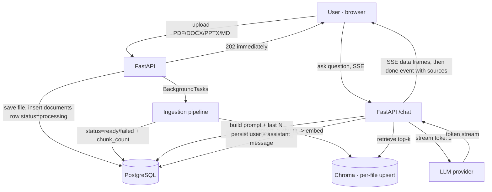

# Architecture

## Request flow

## Data model

Four tables: `users`, `conversations`, `messages`, `documents`. Full DDL in [`knowledgehub-ai.md`](../knowledgehub-ai.md#4-data-model--ddl-postgresql).

Vector store convention (Chroma): every chunk gets a deterministic ID
`{document_id}::{chunk_index}::{content_hash[:12]}` with metadata
`{document_id, user_id, filename, doc_type, department, h1, h2}`. Re-ingesting a file is delete-then-upsert scoped to that file's `document_id` — the whole collection is never rebuilt.

## Design decisions

Captured as they're made; the full writeup lands in Task 24 (portfolio README).

| Decision | Why |
|---|---|
| SSE over WebSockets | One-way token stream (server → client) only; SSE is simpler to implement and debug than a full duplex WebSocket |
| Per-file upsert over full rebuild | Re-embedding the whole knowledge base on every upload doesn't scale past a handful of documents |
| Monorepo | Backend and frontend evolve together during MVP; API contract is the only coupling, changes land in one commit |
| `BackgroundTasks` over Celery (v1) | No queue/worker infra needed yet; revisit only if ingestion volume demands it |
